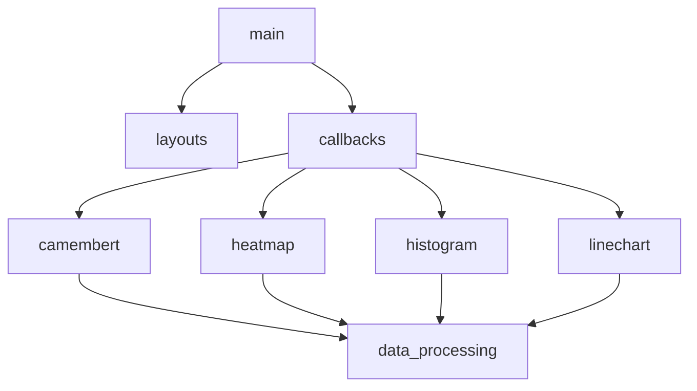

# E3FI - PR2 : Projet de Python

L’objectif du mini projet est d’éclairer un sujet d’intérêt public (météo, environnement, politique, vie publique, finance, transports, culture, santé, sport, économie, agriculture, écologie, etc…) que vous choisissez librement. Vous utiliserez des données publiques Open Data, accessibles et non modifiées.

> Explore the dynamic landscape of sports in France with our interactive dashboard. Whether you're curious about the most popular sports in your region, interested in the demographics of sports enthusiasts, or want to track the evolution of sports participation over the years, our dashboard has you covered.

## USER GUIDE

### INSTALLATION

1. Clonez ce dépôt dans votre environnement local :

   git clone https://github.com/71m07h33/E3-PR2-Miniprojet.git

2. Accédez au répertoire du projet :

   cd E3-PR2-Miniprojet

3. Installez les dépendances nécessaires :

   $ python -m pip install -r requirements.txt

4. Télécharger les données, nécessaires au fonctionnement du dashboard :

   $ python get_data.py

### UTILISATION

1. Éxecuter le fichier main.py dans une invite de commande. Le fichier va ainsi installer les fichiers de données necessaires

   $ python main.py

2. Ouvrez un navigateur web taper:

   http://127.0.0.1:8050/

   - Au démarage, il a un petit temps d'attente le temps que les fichiers de données .csv soient lu, il est donc normal que le dashboard ne s'affiche pas instentanément.

   - Vous pouvez maintenant accéder au Dashboard.

3. Remplissez les paramètres:

   - Attention : Il est primordiale de remplir tout les paramètres avant d'aller regarder les résultats.

4. Utilisation des graphiques :
   - Camembert : Vous pouvez cacher des donnée et cliquant dans la légende
   - Histogram & Graphique : Vous pouvez agrandir en selectionnant une zone du schéma 
   - Carte : Vous pouvez agrandir avec la mollette. En passant la sourie sur un point, vous aurez le nombre précis de licensiées

5. Attention : Le Dropdown Fédération dépend du dropdown Commune, dépendant du dropdown Département, dépendant du dropdown Année. Ainsi, modifier l'un de ces dropdown peut dans de très rare cas générer des bugs. Pour remédier à ce problème, il suffit de recharger la page et de mettre les paramètres voulu.

## ANALYSE DES DONNÉES

### ELEMENT 1 : CAMEMBERT DES ACTIVITÉS

L'utilisateur choisis :
   - Une année d'étude
   - Un département
   - Une commune

=> On génère un camembert représentant l'ensemble des activités des Fédérations de la commune

### ELEMENT 2 : HISTOGRAMME COMPOSITION DES SPORTS EN FONCTIONS DE L'AGE ET DU SEXE

L'utilisateur choisis :
   - Une année d'étude
   - Un département
   - Une commune
   - Une fédération de sport

=> On génère un histogramme avec le nombre de licenciés dans un sport dans une région en fonction de l'âge (Homme, Femme pour chaque catégorie d'âge)

### ELEMENT 3 : GRAPHIQUE DE L'EVOLUTION DU NOMBRE DE LICENSES EN FONCTION DE L'AGE ET DU SEXE

L'utilisateur choisis :
   - Un département
   - Une commune
   - Une fédération de sport
   - Une catégorie d'âge
   - Un genre

=> On génère un graphique "ligne" avec le nombre de licenciés dans un sport dans une commune en fonction de l'âge et du genre

### ELEMENT 4 : CARTE DYNAMIQUE CONCENTRATION SPORTIF

L'utilisateur choisis :
   - Une année d'étude
   - Une fédération de sport
   - Une catégorie d'âge
   - Un genre

=> On génère une cartre chaud/froid du département avec la concentration du sport dans chaque commune

## DEVELOPER GUIDE

### LE PROJET

Le projet est constitué de 4 dossiers à sa racine :

1. Components : le dossier où les @callback sont effectués et est dessiné le layout de l'application

2. Dashboard : le dossier où chaque élément du dashboard est créer et mis à jour. Le fichier python possède la fonction permettant de faire l'update de l'élément.

3. Data : le dossier où les donnée sont stockées. Le dossier possède 3 fichers représentant respéctivement les données de 2019, 2020 et 2021

4. Helper : le dossier contient seulement un fichier data_processing.py qui permet d'extraire et de traitées les données brutes afin qu'elles soient plus facilement utilisable.

### AJOUTER DU CODE

Pour ajouter du code : exemple de l'ajout d'un nouvel élément au Dashboard

1. Créer le fichier python lié à l'élément dans le dossier Dashboard avec sa fonction

2. Ajouter les Div nécessaires dans le ficier layouts.py

3. Effectuer les @callback necessaires dans le fichier callback.py dans le dossier Components

4. Si besoin : créer une fonction dans data_processing.py pour récupérer les données des fichiers .csv

### AJOUTER DES DONNEES

   -  Ajouter le download necessaire dans le fichier get_data.py afin de pouvoir récupérer les données directement dans le projet en fournissant le lien vers le fichier .csv à ajouter.

   - Le code ira automatiquement l'ajouter au dossier Data en le téléchargeant

   - Attention, pour assurer le bon fonctionnement du dashboard, il est important de vérifier que les nouvelles données possèdent le même modèle que les données existantes

## Architecture du code

## Copyright
Je déclare sur l’honneur que le code fourni a été produit par moi/nous même, à l’exception des lignes ci dessous.

Pour chaque ligne (ou groupe de lignes) empruntée, donner la référence de la source et une explication de la syntaxe utilisée.

Toute ligne non déclarée est réputée être produite par l’auteur (ou les auteurs) du projet. L’absence ou l’omission de déclaration sera considéré comme du plagiat.

